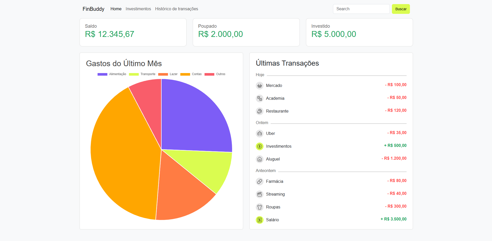

# FinBuddy

FinBuddy é o meu projeto Fintech da <a href="https://www.fiap.com.br/">FIAP</a>, nessa primeira entrega eu criei uma homepage projetada para ajudar os usuários a controlarem e monitorarem seus gastos de forma fácil e eficiente.



## Objetivo

O objetivo do FinBuddy é fornecer uma ferramenta simples e intuitiva para que os usuários possam:

- Registrar suas despesas diárias.
- Visualizar relatórios de gastos.
- Estabelecer metas financeiras.

## Funcionalidades

- **Registro de Despesas**: Permite aos usuários adicionar e categorizar suas despesas.
- **Relatórios de Gastos**: Gera gráficos e relatórios detalhados para ajudar os usuários a entenderem seus hábitos de consumo.
- **Metas Financeiras**: Ajuda os usuários a definir e acompanhar metas de economia.

## Tecnologias Utilizadas

- **HTML5**: Estrutura da página.
- **CSS3**: Estilização e layout.
- **BOOTSTRAP5**: Estilização e componentes prontos.
- **JavaScript**: Funcionalidades interativas.

## Como Usar

1. Clone o repositório:
   ```bash
   git clone git@github.com:sales-gb/finbuddy-rm560076-FIAP-ADS-ON-FASE4.git
   ```
2. Navegue até o diretório do projeto:
   ```bash
   cd finbuddy
   ```
3. Abra o arquivo `index.html` no seu navegador.

## Autor

<black><a href="https://www.linkedin.com/in/gabriel-sales-bezerra/">Gabriel Sales</a></black>

---

Espero que isso ajude! Se precisar de mais alguma coisa ou de ajustes específicos, é só me avisar. 😊
